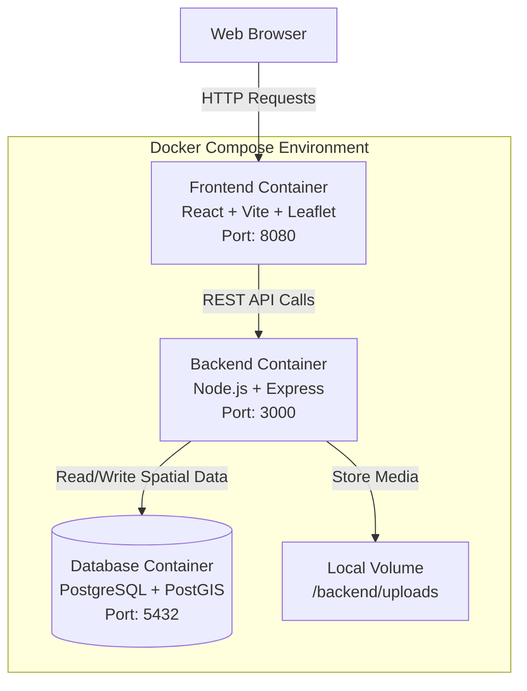
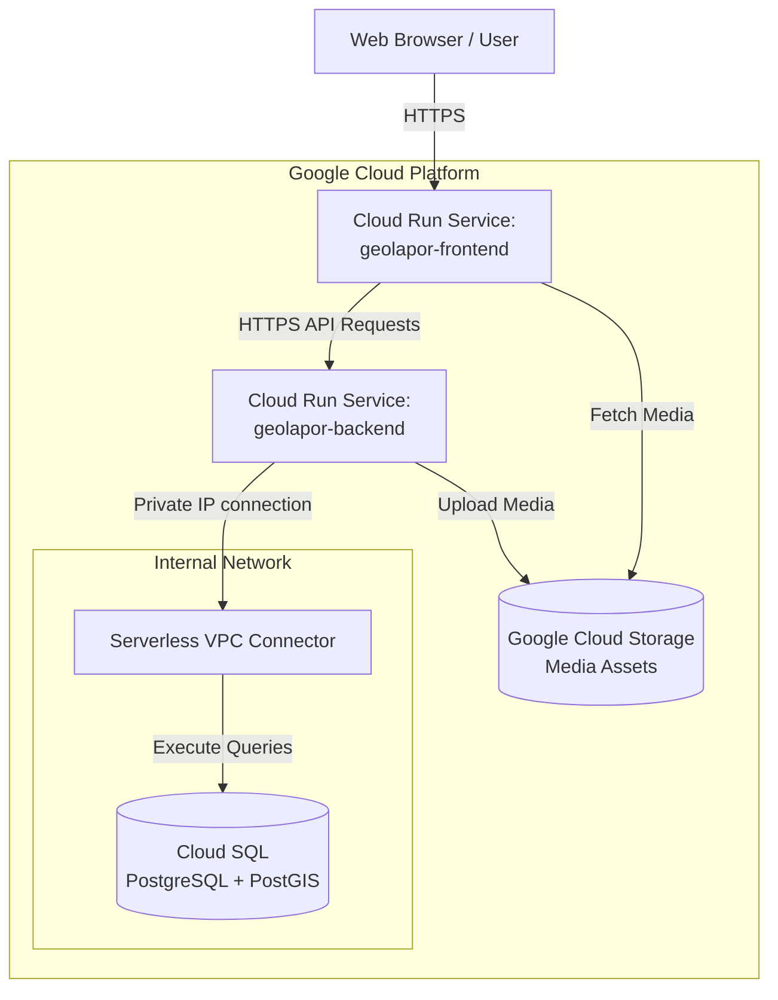
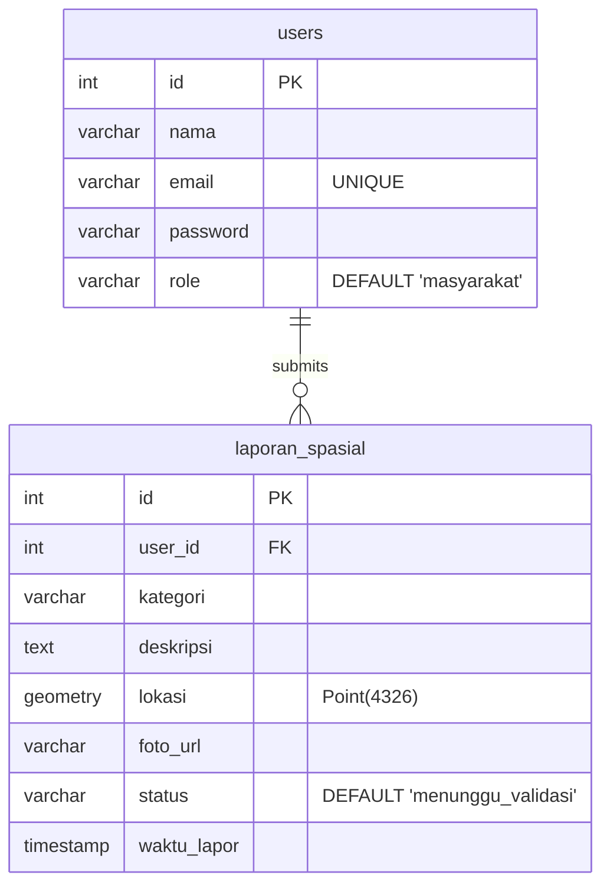
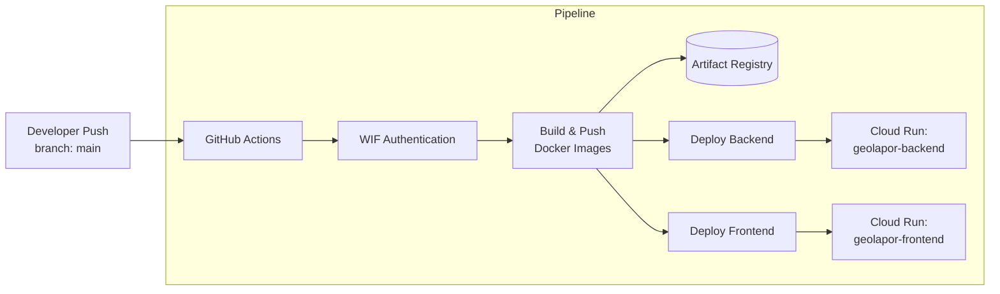

# GeoLapor - Spatial Reporting WebGIS Platform


<!-- Add a hero image or architecture overview screenshot here -->


## 📌 Project Overview

GeoLapor is a comprehensive WebGIS-based spatial reporting platform designed to empower communities to report geographic incidents efficiently. By combining a modern web frontend with a robust geographic backend, the platform enables users to submit reports that include specific location coordinates, descriptive information, and photographic evidence. 

The core value proposition of GeoLapor lies in its ability to visualize community-reported data on an interactive map interface, bridging the gap between incident occurrence and administrative response. It is built using a cloud-native architecture, ensuring high availability, scalable storage for media assets, and secure data handling through modern authentication mechanisms. This system can be readily utilized by municipalities, environmental agencies, or infrastructure management teams for crowdsourced data collection and spatial analysis.

## ✨ Key Features

*   **Interactive Spatial Reporting:** Users can drop pins on an interactive map to report exact incident locations, categorized by issue type.
*   **Media Integration:** Supports uploading photographic evidence for each report, securely stored in cloud object storage (Google Cloud Storage).
*   **Geospatial Data Management:** Leverages PostGIS to store, query, and analyze spatial geometry (Point coordinates) efficiently.
*   **Role-Based Access Control:** Secure JWT-based authentication to differentiate between community users (masyarakat) and administrators, ensuring data integrity and privacy.
*   **Automated Cloud Deployment:** Fully automated CI/CD pipeline using GitHub Actions to deploy containerized microservices directly to Google Cloud Run.

## 🏗️ System Architecture (local/development)

In the local development environment, the system utilizes Docker Compose to orchestrate three primary containers: Frontend, Backend, and Database. The frontend communicates with the backend via RESTful APIs, while the backend processes business logic, handles file uploads locally to a mounted volume, and interacts with the PostGIS database.



## ☁️ System Architecture (cloud/production)

The production environment is hosted entirely on Google Cloud Platform (GCP). It utilizes a serverless container architecture via Cloud Run for both the frontend and backend. The backend connects securely to a managed Cloud SQL instance (PostgreSQL with PostGIS) using a Serverless VPC Access Connector. Media files uploaded by users are streamed to a Google Cloud Storage bucket and served via a CDN URL directly to the frontend.



## 📊 Database Table Relationship Diagram (TRD/ERD)

The database schema utilizes standard relational structures enhanced with spatial geometry columns. The core entities include `users` for authentication and `laporan_spasial` for spatial incident reporting.



## 💻 Tech Stack

The project utilizes a modern JavaScript/TypeScript ecosystem for the application layers and robust infrastructure tooling for deployment.

### Frontend
*   **Framework:** React 19
*   **Build Tool:** Vite
*   **Styling:** Tailwind CSS v4
*   **Mapping Engine:** Leaflet & React-Leaflet
*   **HTTP Client:** Axios
*   **Routing:** React Router DOM

### Backend
*   **Runtime:** Node.js
*   **Framework:** Express 5
*   **Authentication:** JSON Web Tokens (JWT) & bcrypt
*   **File Upload Handling:** Multer
*   **Database Driver:** pg (node-postgres)
*   **Cloud Storage SDK:** @google-cloud/storage

### Database
*   **RDBMS:** PostgreSQL
*   **Spatial Extension:** PostGIS

### Infrastructure & DevOps
*   **Containerization:** Docker & Docker Compose
*   **CI/CD Pipeline:** GitHub Actions
*   **Cloud Provider:** Google Cloud Platform (GCP)
*   **Compute:** Google Cloud Run
*   **Container Registry:** Google Artifact Registry (GAR)
*   **Managed Database:** Google Cloud SQL
*   **Authentication Mechanism:** Workload Identity Federation (WIF)

## 🚀 Getting Started / Installation

To run this project locally, ensure you have **Docker** and **Docker Compose** installed on your machine. The setup uses pre-configured Dockerfiles and a `docker-compose.yml` that handles initialization automatically.

### Prerequisites
*   Docker Desktop or Docker Engine
*   Git

### Steps to Run Locally

1.  **Clone the repository:**
    Open your terminal and clone the repository to your local machine.
    ```bash
    git clone <repository-url>
    cd <repository-directory>
    ```

2.  **Start the application stack:**
    Use Docker Compose to build the images and start the services. This command will initialize the database, build the backend, and build the frontend.
    ```bash
    docker-compose up --build -d
    ```

3.  **Access the applications:**
    Once the containers are running, you can access the services at the following local URLs:
    *   **Frontend Interface:** [http://localhost:8080](http://localhost:8080)
    *   **Backend API:** [http://localhost:3000](http://localhost:3000)
    *   **Database:** `localhost:5432` (Credentials: `admin` / `password123`)

4.  **Stopping the application:**
    To stop and remove the containers, networks, and volumes (optional):
    ```bash
    docker-compose down
    ```

*Note: The local setup automatically initializes the necessary database tables using the `database.sql` script mounted to the PostGIS entrypoint.*

## ⚙️ CI/CD & Deployment

The deployment pipeline is fully automated using **GitHub Actions**. Upon any push to the `main` branch, the workflow orchestrates the building, pushing, and deploying of the application components to Google Cloud Platform.

### Deployment Pipeline Workflow

1.  **Checkout & Authentication:** Retrieves the source code and authenticates with GCP using Workload Identity Federation (WIF) for enhanced security over static service account keys.
2.  **Backend Deployment:**
    *   Builds the backend Docker image using `./geolapor-backend/Dockerfile`.
    *   Pushes the image to Google Artifact Registry.
    *   Deploys the image to Google Cloud Run.
    *   Injects critical environment variables (Database credentials, JWT secret, GCS bucket name) from GitHub Secrets.
    *   Attaches the service to a Serverless VPC Connector for secure communication with Cloud SQL.
3.  **Frontend Deployment:**
    *   Builds the frontend Docker image using `./frontend/Dockerfile`.
    *   Passes build arguments (`VITE_API_URL` and `VITE_CDN_URL`) dynamically retrieved from the backend deployment step and secrets.
    *   Pushes the image to Google Artifact Registry.
    *   Deploys the image to Google Cloud Run, exposing it on port 80.



## 📜 License

MIT License 
*(<!-- Note: A LICENSE file needs to be added to the repository root. Assuming MIT as placeholder. -->)*
